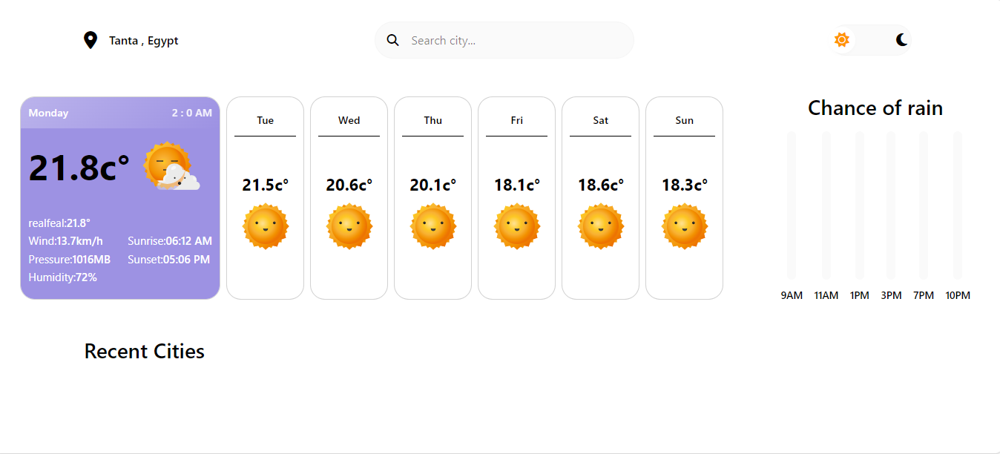
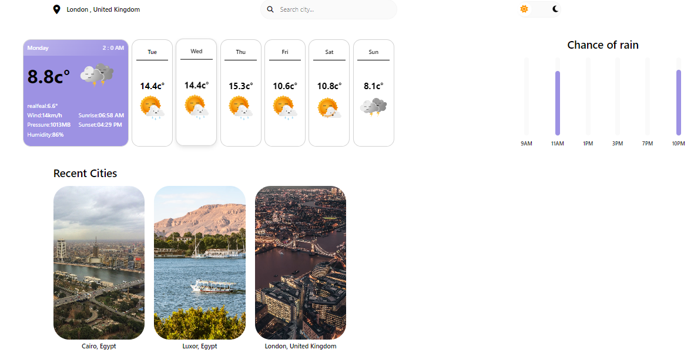
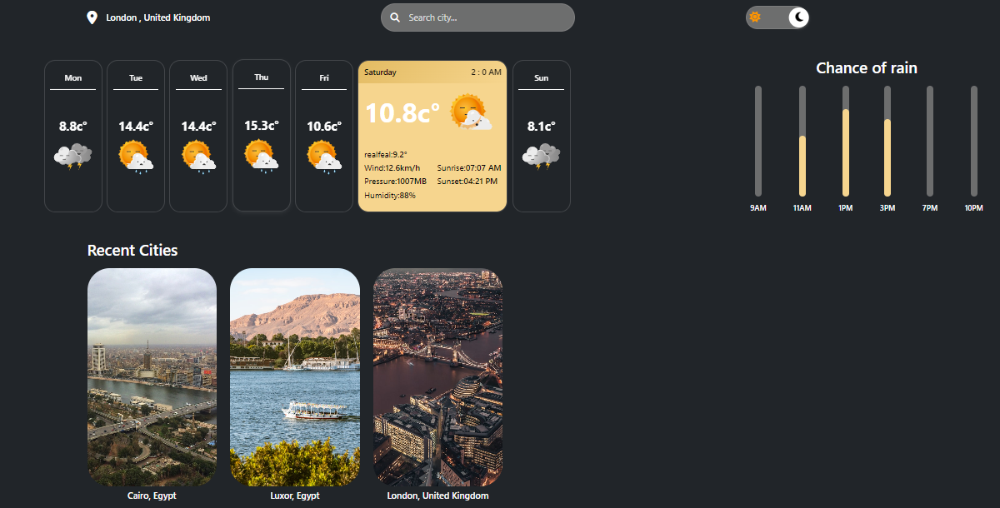

# Weather App 🌤️

 
     
  <em>Real-time weather insights at your fingertips</em> 

**Weather App** is a modern, interactive web application that delivers real-time weather information with stunning visuals. Search for any city worldwide, explore detailed forecasts, and make informed decisions with intuitive data visualizations.

---

## ✨ Features

### 🌍 Global Weather Search
- Real-time weather updates for any city worldwide  
- Accurate current conditions and extended forecasts  

### 📊 Detailed Weather Analytics
- Expandable cards with comprehensive data:  
  - Temperature trends & "Feels Like"  
  - Wind speed & direction  
  - Humidity levels  
  - Sunrise & sunset times  
  - Interactive charts for precipitation probability  

### 🎨 Smart User Experience
- Auto theme detection (light/dark mode)  
- Smooth transitions and animations  
- Recent searches with beautiful Unsplash imagery  
- Geolocation support for instant local weather  

### 📱 Universal Compatibility
- Fully responsive design (mobile, tablet, desktop)  
- Cross-browser compatibility  
- Fast loading & optimized performance  

---

## 🛠️ Tech Stack

   
   
   
   
   

### APIs Integration
- WeatherAPI.com - Accurate weather data  
- Unsplash API - Stunning city imagery  

---

## 🖼️ Application Preview

  
  
  

  Light Theme &nbsp;&nbsp;&nbsp; Dark Theme &nbsp;&nbsp;&nbsp; 

---

## 🚀 Quick Start

### Prerequisites
- Modern web browser  
- Internet connection  
- WeatherAPI key (for development)

